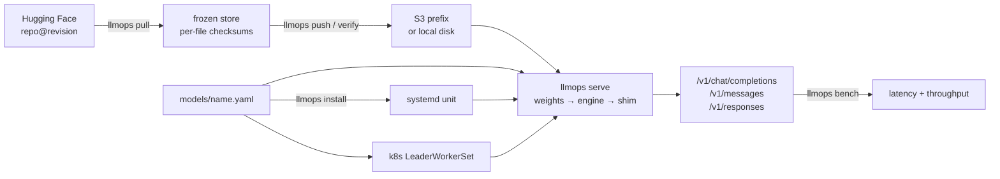

# llmops

[](https://github.com/latere-ai/llmops/actions/workflows/ci.yml)
[](go.mod)
[](LICENSE)

Run open-weight models on GPUs you control, end to end. One Go binary
freezes the weights, starts the inference engine, serves OpenAI- and
Anthropic-compatible endpoints behind a health contract, and measures
what came up.

Two deploy modes share one manifest schema and one serving contract:
Kubernetes for a multi-GPU fleet, and an installed binary under systemd
for a single-GPU host with no cluster around it.



## Why run it yourself

- **Weight freeze.** Upstream Hugging Face repos mutate and disappear.
  Every model is pinned to a revision and checksummed per file, then
  never re-downloaded from upstream — into an S3 prefix for a fleet, or
  in place on a host's own disk. `/ready` does not flip until the
  weights on disk match the manifest.
- **Cost and control.** Serving on your own GPUs beats per-token router
  pricing at sustained load, and removes third-party rate limits,
  silent model swaps, and data egress to a router.
- **One surface, whatever the caller speaks.** An Anthropic SDK, an
  OpenAI Chat client and an OpenAI Responses client all hit the same
  endpoint. What a translation cannot carry is reported, not dropped
  silently.
- **A path to post-training.** Weights you control are the prerequisite
  for fine-tuning or RL later.

## Quick start

Go 1.27 or newer, no cgo, no other build dependency:

```sh
git clone https://github.com/latere-ai/llmops.git
cd llmops
make build
```

Freeze a model onto a host's own disk, then serve it:

```sh
llmops pull   Qwen/Qwen3.8-27B@<sha> --dir ~/.models/Qwen/Qwen3.8-27B/<sha>
llmops freeze Qwen/Qwen3.8-27B@<sha> --dir ~/.models/Qwen/Qwen3.8-27B/<sha>
llmops validate models/
llmops serve --manifest models/qwen3.8-27b.yaml --cache-root ~/.models
```

For a fleet, the weights go to any s5cmd-reachable bucket — AWS S3, DO
Spaces, R2 and MinIO all work — and the same `serve` runs as the
container entrypoint:

```sh
llmops push moonshotai/Kimi-K2.7-Code@<sha> \
    --dir /scratch/kimi --bucket s3://<your-bucket>
llmops verify s3://<your-bucket>/moonshotai/Kimi-K2.7-Code/<sha>/
```

Ask the endpoint anything an OpenAI or Anthropic client can ask:

```sh
curl -s localhost:8000/v1/messages -H 'Content-Type: application/json' \
  -d '{"model":"qwen3.8-27b","max_tokens":64,
       "messages":[{"role":"user","content":"hello"}]}'

llmops bench --url http://localhost:8000 --model qwen3.8-27b \
    --concurrency 8 --requests 32 --out report.json
```

## Commands

```
llmops pull     <hf_repo>[@revision] --dir <dir>    fetch from Hugging Face
llmops freeze   <hf_repo>@<sha> --dir <dir>         write the store manifest in place
llmops push     <hf_repo>@<sha> --dir <dir> --bucket <root>
llmops verify   <prefix>                            check a store against its manifest
llmops list     --bucket <root>                     what is mirrored there
llmops serve    --manifest <manifest.yaml>          run a model
llmops validate <models-dir | manifest.yaml>        check manifests and deploys
llmops install  --manifest <manifest.yaml>          place the unit + manifest on a host
llmops bench    --url <base> --model <id>           measure a live endpoint
llmops version
```

## Documentation

| Doc | For | What it answers |
|---|---|---|
| [Models](docs/models.md) | anyone | What is served, on what hardware, and what each endpoint answers |
| [Deploy guide](docs/deploy.md) | operators | Build images, freeze weights, deploy on k8s or systemd, every config knob |
| [Sizing a model for a GPU](docs/practice.md) | operators | Whether a model fits a machine, and how fast it will be once it does |
| [Development](docs/development.md) | contributors | Build from source, the test targets, repo layout |
| [Specs](specs/README.md) | contributors | The design records behind every decision |

## Status

Working today: the `llmops` command end to end — weight fetch, freeze
and verify, the serving entrypoint and health shim, all three caller
dialects, the bench harness, and `install` for a bare-metal host.
Pinned manifests with the deploy artifact each one owns, and a
consistency check between them that runs in CI and in `llmops validate`.
The whole pipeline is exercised end to end on a laptop.

Not yet done: the multi-hundred-GB mirrors and the GPU deployments. The
per-model specs record what each one is blocked on, and the
monitoring-plane specs (012 through 016) are design only, with no code
in this repo yet.

APIs are not frozen. The manifest schema, the shim's endpoints and the
CLI flags may change while the first models are brought up.

## How Latere uses it

Latere runs llmops as its inference layer: seven open-weight models,
frozen once into S3, served on bare-metal Kubernetes GPU nodes and one
single-GPU GB10 host, registered as providers behind Lux, the Latere
model gateway. Lux serves its own dialect and embeds the same
translator package, so a model endpoint and the gateway in front of it
never disagree about what a request means.

That set is one deployment's answer, not the tool's. The fleet, the
hardware it runs on, and what each model is blocked on are in
[docs/models.md](docs/models.md).

## License

MIT. See [LICENSE](./LICENSE).
