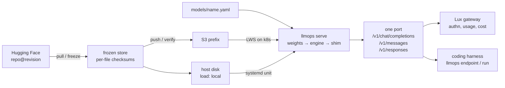

# llmops Architecture (umbrella)

## Overview

Own the inference layer for open-weights models end to end, replacing
router-mediated access (OpenRouter) for the models we care about:

| Model | Shape | Precision | Ctx | Hardware | Spec |
|---|---|---|---|---|---|
| MiniMax-M3 | 428B MoE, 23B active | MXFP8 | 1M | 8x H200 | [[006-model-minimax-m3]] |
| GLM-5.2 | 753B MoE, ~40B active | FP8 | 1M | 8x H200 | [[005-model-glm-5.2]] |
| Kimi-K2.7-Code | 1T MoE, 32B active | INT4 QAT | 256K | 8x H200 | [[004-model-kimi-k2.7-code]] |
| DeepSeek-V4-Pro | 1.6T MoE, 49B active | FP4+FP8 | 1M | 8x B200 | [[007-model-deepseek-v4-pro]] |
| DeepSeek-V4-Flash-0731 | 304B MoE, 13B active | FP4+FP8 | 1M | 8x B200 | [[017-model-deepseek-v4-flash-0731]] |
| Kimi-K3 | 2.8T MoE, 104B active | MXFP4/MXFP8 | 1M | 8x B300 | [[018-model-kimi-k3]] |
| Qwen3.8-27B | 27B **dense**, multimodal | BF16 | 256K | 1x GB10 | [[022-model-qwen3.8-27b]] |

The last one is deliberately unlike the others, and the registry is not
only for frontier-scale MoE: it is what we choose to own. A model small
enough to run undamaged on one GPU is a different product from a huge
one squeezed to fit, not a lesser version of it.

Three planes:

1. **Weights plane** — frozen, checksummed mirrors, in our S3 bucket or
   on a host's own disk ([[002-weights-registry]],
   [[021-local-weight-loading]]). Never re-download from HF. The freeze
   guarantee is a pinned revision plus per-file checksums, not the
   storage behind them.
2. **Serving plane** — inference engine(s) behind one shim, in either of
   two deploy modes: k8s on multi-GPU nodes loading from S3, or an
   installed binary under systemd on a single-GPU host
   ([[001-inference-engine-selection]], [[003-serving-runtime]],
   [[008-k8s-serving]], [[020-bare-metal-packaging]]). Both run the same
   `llmops serve` and share the manifest schema, so a model's
   description does not depend on how it is started.
3. **Access plane** — two ways in, and neither is a gateway
   reimplementation. Endpoints register in Lux, the latere model
   gateway, which owns authn, keys, usage and cost
   ([[009-lux-integration]]); and a coding harness points straight at a
   host with no gateway in the path ([[026-harness-integration]]).

Every model serves all three caller dialects on one port. The engine's
own dialect is declared per manifest; the other two translate through
`llmdialect`, which reports what a translation could not carry rather
than dropping it ([[025-dialect-surfaces]]). Lux embeds the same
translator package, so the gateway and the endpoint behind it never
disagree about what a request means.

One binary does all of it. `mirror`, `runtime` and `bench` collapsed
into `llmops` with a flat set of subcommands ([[024-single-cli]]),
because shipping three binaries to a host is a cost the container mode
never paid. Thirteen of them today, after [[026-harness-integration]]
added `ps`, `endpoint` and `run`.

## Constraints

- The MoE targets are very large: the minimum serving unit is an
  8x H200-class node (Kimi-K2.7 INT4, GLM FP8, MiniMax MXFP8).
  DeepSeek-V4-Pro at 864.7 GB does **not** fit 8x H100 and wants 8x
  B200/B300 for its native FP4 path; Kimi-K3 at 1561 GB needs a B300
  pool that does not exist yet. Hardware acquisition is out of scope
  here (infrastructure provisioning) but specs must state each model's
  exact GPU footprint.
- The registry is ~4.4 TB across the seven manifests, not the ~2.7 TB
  [[002-weights-registry]] budgeted for the first four. K3 alone
  outweighs those four.
- The single-GPU class is a different shape, not a smaller one: one GPU,
  one memory pool shared with the CPU, and no cluster around it
  ([[019-gb10-serving-target]]). Its first constraint is memory
  *behaviour* — an engine's memory fraction is taken from the host's RAM
  too. Its second is throughput, and that one is now measured rather
  than predicted: undamaged BF16 weights serve at **3.0 tok/s**, and the
  same model with 4-bit weights and a draft head has been measured at
  **51.5** ([[027-qwen-fast-path]]). Precision is a product decision on
  this hardware, not a tuning detail.
- License hygiene per model, recorded in `models/*.yaml`. Two are
  **blocking gates**, not notes: MiniMax-M3's Community License needs a
  commercial-use notice that has not been sent, and Kimi-K3's
  Model-as-a-Service clause needs a determination on whether Lux
  exposure counts as internal use. Neither model reaches Lux until its
  gate clears. The rest are clean: GLM-5.2 and DeepSeek-V4 are MIT,
  Kimi-K2.7 is modified-MIT (attribution clause), Qwen3.8-27B is
  Apache-2.0.
- The shared latere service conventions apply: `/healthz`, `/ready`,
  `/metrics` contract, Docker + k8s packaging, e2e-verified features.

## Spec tracks

Specs are numbered in the order they were written, which is close to but
not the same as dependency order. They group into six tracks.
[specs/README.md](README.md) is the single status surface — what is
built and what each built spec still owes lives there, checked by a test,
and is deliberately not duplicated here.

| Track | Specs | Delivers |
|---|---|---|
| Foundation | 001–003 | Engine decision record, HF→S3 mirror + manifests, the serving runtime every model shares |
| Fleet models | 004–007, 017, 018 | One spec per multi-GPU model: footprint, engine flags, license gate |
| Platform | 008–010 | LWS GPU deploys with NVMe prefetch, Lux registration, metrics + bench harness |
| Local proof | 011 | The whole pipeline at laptop scale, with real MinIO and a real engine |
| jspace plane | 012–016 | Jacobian lens fitting, in-engine capture, readout API, dashboards |
| GB10 track | 019–027 | Single-GPU bare-metal host: deploy mode, local weight loading, first serving model, one CLI, all dialects, harness integration, fast path |

Order rationale: 001 and 002 unblock everything and 003 needs both. A
model spec needs 003 plus the deploy mode it uses. Kimi-K2.7-Code went
first among fleet models because native INT4 on one 8x H200 node is the
cheapest full path to prove S3 → engine → k8s → Lux; DeepSeek-V4-Pro is
last because it has the hardest hardware requirement, and 017 exists so
that block does not also block having a DeepSeek endpoint.

The GB10 track changed no earlier decision. Both pinned engine images
already publish linux/arm64 and vLLM's sm_120 kernels run on this GPU by
binary compatibility, so 001 stands; and 020 adds a **second** deploy
mode beside Kubernetes rather than replacing it, because a one-GPU host
has nothing for a scheduler to schedule.

## Non-goals

- Post-training (fine-tuning/RL). Frozen BF16/base weights make it
  *possible* later; the training stack belongs to a separate repo. This
  repo's only obligation: don't preclude it, keep base-checkpoint
  mirroring supported in the registry tool.
- Domain API wrappers (OCR endpoints and the like) — those stay their
  own repos. But their *weights* belong in the registry, and their
  containers can deploy here via `runtime: custom`
  ([[003-serving-runtime]]): the repo is scoped to any self-hosted
  open-weights model (OCR, audio, multimodal, embeddings), not only
  frontier chat LLMs.
- Building our own gateway features — authn, key issuance, usage
  accounting, cost. Lux owns those. Generating a harness config from a
  manifest ([[026-harness-integration]]) is not one of them: it derives
  a port, a dialect path and a file format that the manifest already
  determines.
- Serving the Lux dialect from a model endpoint. It belongs to the
  gateway, which embeds the same translator package.

## Verification

Umbrella is done when every spec in the tracks above is individually
verified, and at least one fleet model serves production traffic through
Lux from S3-frozen weights.

Neither half holds yet. The weights plane, the serving plane and the
local half of the access plane are built and one model serves on a GB10
host from its own disk. But no multi-hundred-GB mirror exists, nothing
runs on a GPU node, and no model is registered in Lux — so the umbrella
stays `draft` while its parts advance.
