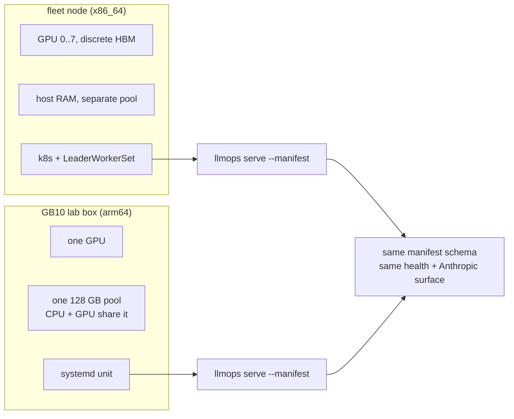

# GB10 serving target (single GPU, unified memory, bare metal)

## Overview

Every node the fleet serves on is the same shape: an x86_64 host with
4-8 discrete GPUs, each with its own HBM, tensor-parallel across the
node, scheduled by Kubernetes. GB10 differs in three ways at once — one
GPU, one memory pool shared with the CPU, an arm64 host — and it is not
a fleet node at all. It is a **lab machine**: a single box serving
models directly, with no cluster to schedule it and no second node to
fail over to.

This spec states what that class costs and how a model runs on it.

It does **not** change the engine choice. Both engines already publish
arm64 builds, so [[001-inference-engine-selection]] stands unamended.

## Facts (verified 2026-08-28)

- **One GPU.** GB10 is a single Blackwell die fused with an arm64 Grace
  CPU. `--tp-size` is 1, and every multi-GPU sharding flag the fleet
  manifests carry is inapplicable.
- **Compute capability sm_121**, CUDA 13.0, driver floor r580.
- **Nothing is compiled for sm_121, and that is fine.** A measured
  install of vLLM v0.28.0 reports
  `arch list: ['sm_80','sm_90','sm_100','sm_110','sm_120']` — the device
  is sm_121 and the highest compiled target is sm_120. It runs because
  12.0 and 12.1 share a major compute-capability version, so the sm_120
  cubins are binary-compatible. The correct claim is **"sm_120 kernels
  run here"**, not "the engines target this GPU". If a future engine
  build drops sm_120, this class breaks with no warning, so the arch
  list is worth re-checking on every engine bump.
- **128 GB LPDDR5X unified** between CPU and GPU. Around 119 GB is
  addressable in practice; plan against **~115 GB** with the OS and
  system services running, less if a desktop session is up.
- `nvidia-smi` reports `[N/A]` for `memory.total`, `memory.free` and
  `memory.used` on this part. GPU memory accounting goes through host
  `/proc/meminfo`, not the device.
- Local NVMe reads at roughly 5 GB/s, which sets the cold-start floor
  once weights are resident on disk.
- Both engine images publish `linux/arm64` at the versions this repo
  pins, and vLLM has shipped aarch64 CUDA wheels since v0.13.0.
  `vllm==0.28.0` installs on this host from a wheel with no build step,
  pulling `torch 2.13.0+cu132`.
- **Startup is slow.** A 0.6B model took **325 s** from launch to
  `/health` returning 200, most of it first-time weight download and
  engine warmup. Readiness timeouts sized for the fleet will be too
  tight here; a 27B model needs materially more.

## Decision: this class uses the bare-metal deploy mode

The repo supports **two deploy modes**, and they coexist:

| Mode | Used by | Artifact |
|---|---|---|
| Kubernetes | the fleet, unchanged | container image + `deploy/<name>/lws.yaml` |
| Bare metal | this class | installed binary + systemd unit |

The Kubernetes path stays exactly as it is; nothing in
[[008-k8s-serving]] changes. What is new is a second mode, defined in
[[020-bare-metal-packaging]], and **GB10 is its first user rather than
its only possible one** — any single-GPU host without a cluster can use
it.

**A GB10 model runs as a host process under systemd, launched by the
same `llmops serve --manifest` entrypoint the fleet uses.**

The Kubernetes path solves fleet problems: scheduling across a pool,
restarting on another node, rolling a version without downtime, packing
models onto shared hardware. A lab box has one GPU, one model at a time,
and no pool. k3s plus a LeaderWorkerSet here is a scheduler with nothing
to schedule, wrapped around a process systemd already supervises.

Everything above the deploy layer is kept unchanged:

| Kept | Why it still earns its place |
|---|---|
| `models/<name>.yaml` | one source of truth for model config, same schema |
| `mirror` + `_manifest.json` | pinned revisions, per-file checksums; provenance does not need a cluster |
| `llmops serve` | `/healthz`, `/ready`, `/metrics`, OpenAI passthrough, and the Anthropic surface at `/v1/messages` |
| `bench` | an HTTP client; it does not care what started the server |
| `load: local` | [[021-local-weight-loading]], now the only sensible mode here |

Not used by this class: the LeaderWorkerSet manifest, the
`nvidia.com/gpu` resource limit, the `latere.ai/gpu-pool` node label,
and the runtime container image. Those remain the Kubernetes mode's
artifacts and are untouched; [[020-bare-metal-packaging]] defines this
mode's equivalents.

### The consistency check applies to both modes

`deploycheck` asserts a model's manifest agrees with its
`deploy/<name>/lws.yaml`. That guarantee is why a manifest change cannot
silently diverge from what actually runs, and it should hold in either
mode. For a bare-metal model it checks the **systemd unit** instead:
that the unit names this model's manifest path and the expected binary.
The check dispatches on the model's deploy mode, so neither mode loses
coverage and neither is checked against the wrong artifact.

## What the class costs

### Unified memory has no separate device budget

On a discrete-HBM node, `--mem-fraction-static 0.90` reserves 90% of
*device* memory and the host keeps its own RAM. On GB10 there is one
pool, so the same flag reserves 90% of everything the operating system
also needs, and the box dies rather than degrades.

**This is measured, not inferred.** vLLM launched with
`--gpu-memory-utilization 0.30` on a 0.6B model held **37,651 MiB** —
0.30 × 128 GB, to within a rounding error, for a model whose weights are
about 1.2 GB. The fraction is applied to the whole unified pool and the
engine fills it. At vLLM's 0.90 default this box would have handed the
engine ~115 GB and left the operating system roughly 13 GB.

```
usable  =  total_unified  −  os_and_services  −  engine_overhead
usable  ≥  weights  +  kv_cache  +  activations
```

The fraction flag cannot simply be banned: both engines size their KV
cache from it, and an **absent** flag is worse than a bad one, because
the engine applies its own default (vLLM's is 0.90) against the whole
128 GB pool and leaves the host about 13 GB. So the flag is **required
and bounded**:

```
fraction  ×  128 GB  ≤  102 GB      →   fraction ≤ 0.80
```

0.80 leaves roughly 26 GB for the OS, page cache, and the desktop
session this class often has running. Both engines *fill* the fraction
they are given rather than staying under it, so the fraction sets actual
consumption: a model needing less should ask for less. See
[[022-model-qwen3.8-27b]].

### GPU memory is not observable through the device

[[010-observability-bench]] assumes GPU memory metrics come from the
device. Here they do not exist there. Memory pressure must be read from
host memory, and any dashboard panel keyed on device memory renders
empty rather than wrong — which is worse, because it looks like a scrape
failure.

### One GPU, so the failure mode is different

There is no partial degradation: the box serves one model or none. A
second model contends for the same pool rather than for a free GPU.
**One model per GB10 box** is a rule rather than a default, because
nothing in the schema would otherwise stop a second unit from starting.

## Manifest shape

```yaml
gpu: { type: gb10, count: 1, nodes: 1 }
```

`GPU.Type` is already a free string, so the shape needs no schema
change. On this class the field is **descriptive**: it records what the
model needs and no longer projects into a Kubernetes resource request.

## Diagram



## Acceptance criteria

- **AC1** A manifest with `gpu: {type: gb10, count: 1, nodes: 1}`
  validates, and validation **rejects** `count > 1` or `nodes > 1` for
  this type — neither exists on this class.
- **AC2** On `gpu.type: gb10`, validation **requires** a memory-fraction
  flag (`--mem-fraction-static` for SGLang, `--gpu-memory-utilization`
  for vLLM) and rejects a value above **0.80**, with an error naming the
  unified-memory reason. Both an absent flag and an over-large one take
  the box down, and the absent case is the likely one because it looks
  like every other manifest in the repo.
- **AC3** Validation requires an explicit context bound on this class
  (`--max-model-len` for vLLM, `--context-length` for SGLang), so the
  `kv_cache` term is stated rather than inherited from an engine
  default.
- **AC4** The 26 GB host reserve implied by the 0.80 ceiling holds under
  a real workload, measured by [[022-model-qwen3.8-27b]] AC5. The
  fraction's behaviour itself is already settled: measured 2026-08-28,
  vLLM at `--gpu-memory-utilization 0.30` held 37,651 MiB on this class,
  confirming the fraction applies to the full 128 GB unified pool and
  that the engine fills it.
- **AC4a** The engine's compiled arch list is re-checked on every engine
  version bump, and the bump is rejected if `sm_120` is absent. This
  class runs on binary compatibility rather than a targeted build, so
  the failure would otherwise appear as a runtime crash after a routine
  upgrade.
- **AC5** `deploycheck` validates a bare-metal model against its systemd
  unit rather than an LWS manifest, and a test fails when the unit names
  a different manifest or binary than the model expects.
- **AC6** Validation rejects a `gpu.type: gb10` model that also carries
  a `deploy/<name>/lws.yaml`, so the two deploy modes cannot both claim
  one model.
- **AC7** `docs/deploy.md` documents this class as a distinct operating mode:
  driver floor r580, CUDA 13, `usable ≈ 115 GB`, the budget formula, and
  the one-model-per-box rule.
- **AC8** [[010-observability-bench]] records that device-memory metrics
  are absent here and that host memory is the substitute signal.

## Out of scope

- Multi-GB10 serving. A model that does not fit one box's 128 GB is not
  a candidate for this class. That is the standing rule, not a temporary
  block.
- Training and post-training.
- Changing the Kubernetes mode. The fleet path is untouched by this
  spec; [[020-bare-metal-packaging]] adds a mode beside it, not instead
  of it.
- Running a GB10 box under Kubernetes. Possible, and deliberately not
  done — if it is ever wanted, the deploy mode is a manifest field, so
  it is a one-line change rather than a new spec.
