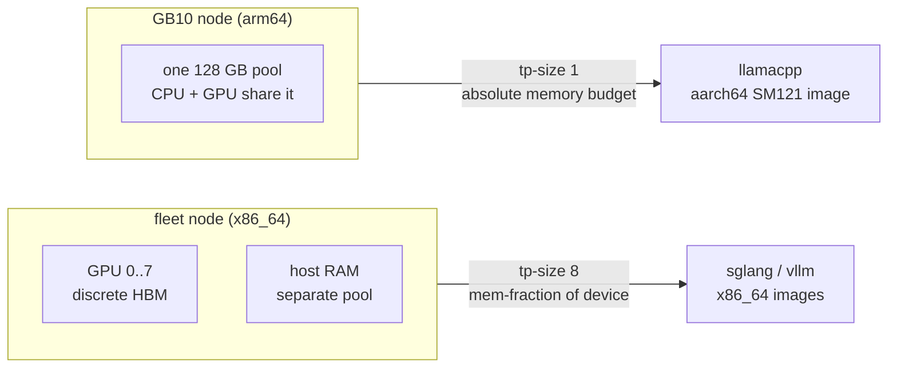

# GB10 serving target (single GPU, unified memory)

## Overview

Every node class the fleet serves on today is the same shape: an x86_64
host with 4-8 discrete GPUs, each with its own HBM, tensor-parallel
across the node. GB10 is a different class, and it breaks three
assumptions that are currently implicit rather than written down.

This spec makes GB10 a first-class `gpu.type` and states what the class
costs. It adds no manifest fields. What it forces is a new engine
([[020-llamacpp-runtime]]) and a new load mode
([[021-local-weight-loading]]); those are separate specs because they are
useful independently of this hardware.

## Facts (verified 2026-08-28)

- **One GPU per node.** GB10 is a single Blackwell die fused with an
  arm64 Grace CPU. There is no intra-node tensor parallelism to exploit:
  `--tp-size` is 1, and every flag the fleet manifests carry for
  multi-GPU sharding is inapplicable.
- **Compute capability SM121**, CUDA 13.0, driver floor r580.
- **128 GB LPDDR5X unified** between CPU and GPU. Around 119 GB is
  addressable in practice; plan against **~115 GB** with the OS and
  system services running, less if a desktop session is up.
- **arm64 host.** Every runtime image the fleet pins is x86_64 only.
- `nvidia-smi` reports `[N/A]` for `memory.total`, `memory.free` and
  `memory.used` on this part. GPU memory accounting goes through host
  `/proc/meminfo`, not the device.
- Local NVMe on this class reads at roughly 5 GB/s, which sets the
  cold-start floor: a 90 GB model is ~20 s of pure I/O once cached, and
  the network fetch that fills the cache dominates first start.

## The three assumption breaks

### 1. No engine image exists for this architecture

`Dockerfile.vllm` pins `vllm/vllm-openai:v0.25.1` and
`Dockerfile.sglang` pins `lmsysorg/sglang:v0.5.16-cu129`. Neither
publishes an aarch64 tag, and neither builds for SM121. The upstream
blocker is PyTorch: there are no arm64 CUDA wheels at the versions these
engines require, and vLLM's precompiled kernels link `libcudart.so.12`
against a CUDA 13 system
([vllm-project/vllm#31128](https://github.com/vllm-project/vllm/issues/31128)).

Community aarch64 SGLang builds for this GPU exist but sit around
v0.5.8 — **below the v0.5.16 floor [[017-model-deepseek-v4-flash-0731]]
requires for the DSpark path**. So the fleet's DeepSeek configuration
does not transfer to GB10 even if the architecture were solved.

Consequence: GB10 needs its own engine. See [[020-llamacpp-runtime]].

### 2. Unified memory has no separate device budget

On a discrete-HBM node, `--mem-fraction-static 0.90` reserves 90% of
*device* memory and the host keeps its own RAM. On GB10 there is one
pool, so the same flag reserves 90% of everything the operating system
also needs, and the node dies rather than degrades.

The budget a model must be planned against is:

```
usable  =  total_unified  −  os_and_services  −  engine_overhead
usable  ≥  weights  +  kv_cache  +  activations
```

Every GB10 model spec states its own `weights + kv_cache` arithmetic
against `usable ≈ 115 GB`. A manifest whose engine flags reserve a
memory *fraction* rather than an absolute budget is a bug on this class,
not a tuning choice.

### 3. GPU memory is not observable through the device

[[010-observability-bench]] assumes GPU memory metrics come from the
device. On GB10 they do not exist there. Memory pressure on this class
has to be read from host memory, and any dashboard panel keyed on
device memory will render empty rather than wrong — which is worse,
because it looks like a scrape failure.

## Decision

**GB10 is a normal `gpu.type` with `count: 1, nodes: 1`, deployed
through the existing LeaderWorkerSet path.**

```yaml
gpu: { type: gb10, count: 1, nodes: 1 }
```

```yaml
nodeSelector:
  latere.ai/gpu-pool: gb10
resources:
  limits:
    nvidia.com/gpu: "1"
```

No schema change is needed for the shape itself: `GPU.Type` is already a
free string, and `deploycheck` already asserts
`resources.limits."nvidia.com/gpu" == GPU.Count`, which holds at 1.

### Considered and rejected: a non-Kubernetes deploy path

A single-GPU node running plain Docker or systemd would be lighter than
k3s plus LWS. Rejected: it forks the deploy mechanism, and every
downstream guarantee — `deploycheck`'s manifest/deploy consistency test
in CI, the readiness contract, Lux registration in
[[009-lux-integration]] — is keyed on the LWS shape. One deploy path
that is slightly heavy beats two paths that drift. Revisit only if k3s
itself proves to cost meaningful memory out of the 115 GB budget, which
is the one number that would change the answer.

## Diagram



## Acceptance criteria

- **AC1** A manifest with `gpu: {type: gb10, count: 1, nodes: 1}`
  validates, and `deploycheck` passes against an LWS that requests
  `nvidia.com/gpu: "1"` with `latere.ai/gpu-pool: gb10`.
- **AC2** `DEPLOY.md` documents the gb10 pool: node label, driver floor
  (r580), CUDA 13, and the `usable ≈ 115 GB` planning number with the
  budget formula.
- **AC3** Manifest validation rejects device-memory-fraction flags
  (`--mem-fraction-static`, `--gpu-memory-utilization`) on
  `gpu.type: gb10`, with an error naming the unified-memory reason.
  This is the one rule that turns a silent node-killer into a CI failure.
- **AC4** A GB10 node label and pool are described in
  [[008-k8s-serving]] alongside the existing pools.
- **AC5** Observability notes in [[010-observability-bench]] record that
  device-memory metrics are absent on this class and that host memory is
  the substitute signal.

## Out of scope

- Multi-GB10 serving. No RDMA fabric is assumed between nodes of this
  class, so a model that does not fit one node's 128 GB is not a GB10
  candidate. That is the standing rule, not a temporary block.
- Training and post-training on this class.
- Replacing the fleet engines with an aarch64 build. If upstream ships
  SM121 aarch64 images later, that is a bump to
  [[001-inference-engine-selection]], not a change here.
