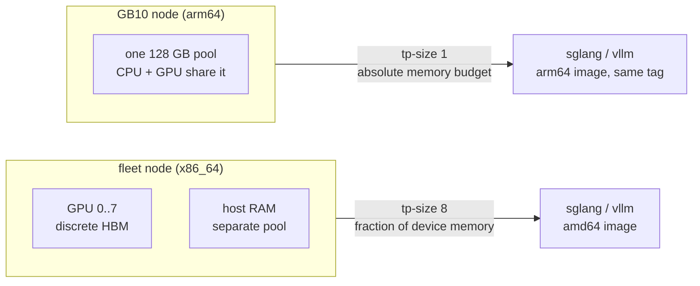

# GB10 serving target (single GPU, unified memory)

## Overview

Every node class the fleet serves on today is the same shape: an x86_64
host with 4-8 discrete GPUs, each with its own HBM, tensor-parallel
across the node. GB10 is a different shape, and it breaks assumptions
that are currently implicit rather than written down.

It does **not** break the engine choice. Both engines run here — see
"What does not change" below. The cost of this class is memory
behaviour, not software availability.

## Facts (verified 2026-08-28)

- **One GPU per node.** GB10 is a single Blackwell die fused with an
  arm64 Grace CPU. There is no intra-node tensor parallelism: `--tp-size`
  is 1, and every multi-GPU sharding flag the fleet manifests carry is
  inapplicable.
- **Compute capability SM121**, CUDA 13.0, driver floor r580.
- **128 GB LPDDR5X unified** between CPU and GPU. Around 119 GB is
  addressable in practice; plan against **~115 GB** with the OS and
  system services running, less if a desktop session is up.
- `nvidia-smi` reports `[N/A]` for `memory.total`, `memory.free` and
  `memory.used` on this part. GPU memory accounting goes through host
  `/proc/meminfo`, not the device.
- Local NVMe on this class reads at roughly 5 GB/s, which sets the
  cold-start floor once weights are resident.

## What does not change

Both engine images already publish `linux/arm64` at the versions the
repo pins, and both build SM121 kernels:

| Image | arm64 | Note |
|---|---|---|
| `lmsysorg/sglang:v0.5.16-cu129` | yes | the pinned tag is multi-arch today |
| `vllm/vllm-openai:v0.28.0` | yes | bumped from v0.25.1 for this class |

vLLM's build config lists compute capability 12.1 (SM121), and it has
shipped aarch64 CUDA wheels since v0.13.0. So this class needs **no new
engine**: it uses the same SGLang-primary, vLLM-second choice recorded in
[[001-inference-engine-selection]], and that decision record stands
unamended.

What the images do not cover is our own layer on top of them — see
[[020-arm64-runtime-images]].

## What does change

### 1. Unified memory has no separate device budget

On a discrete-HBM node, `--mem-fraction-static 0.90` reserves 90% of
*device* memory and the host keeps its own RAM. On GB10 there is one
pool, so the same flag reserves 90% of everything the operating system
also needs, and the node dies rather than degrades.

The budget a model must be planned against is:

```
usable  =  total_unified  −  os_and_services  −  engine_overhead
usable  ≥  weights  +  kv_cache  +  activations
```

Every GB10 model spec states its own `weights + kv_cache` arithmetic
against `usable ≈ 115 GB`.

The fraction flag cannot simply be banned: both engines size their KV
cache from it, and an **absent** flag is worse than a bad one, because
the engine then applies its own default (vLLM's is 0.90) against the
whole 128 GB pool and leaves the host about 13 GB. So on this class the
flag is **required and bounded**:

```
fraction  x  128 GB  <=  102 GB      ->   fraction <= 0.80
```

0.80 leaves roughly 26 GB for the operating system, the container
runtime and page cache. That is a schema rule a manifest can be checked
against, unlike "state an absolute budget", which neither engine
accepts.

### 2. GPU memory is not observable through the device

[[010-observability-bench]] assumes GPU memory metrics come from the
device. On GB10 they do not exist there. Memory pressure has to be read
from host memory, and any dashboard panel keyed on device memory renders
empty rather than wrong — which is worse, because it looks like a scrape
failure.

### 3. One GPU, so the failure mode is different

At `count: 1` there is no partial degradation: the node serves one model
or none. A second model on the same node contends for the same pool
rather than for a free GPU. One model per GB10 node is the rule.

## Decision

**GB10 is a normal `gpu.type` with `count: 1, nodes: 1`, deployed
through the existing LeaderWorkerSet path.**

```yaml
gpu: { type: gb10, count: 1, nodes: 1 }
```

```yaml
nodeSelector:
  latere.ai/gpu-pool: gb10
resources:
  limits:
    nvidia.com/gpu: "1"
```

No schema change is needed for the shape: `GPU.Type` is already a free
string, and `deploycheck` already asserts
`resources.limits."nvidia.com/gpu" == GPU.Count`, which holds at 1.

### Considered and rejected: a non-Kubernetes deploy path

A single-GPU node running plain Docker or systemd would be lighter than
k3s plus LWS. Rejected: it forks the deploy mechanism, and every
downstream guarantee — `deploycheck`'s consistency test in CI, the
readiness contract, Lux registration in [[009-lux-integration]] — is
keyed on the LWS shape. One deploy path that is slightly heavy beats two
that drift.

## Diagram



## Acceptance criteria

- **AC1** A manifest with `gpu: {type: gb10, count: 1, nodes: 1}`
  validates, and `deploycheck` passes against an LWS requesting
  `nvidia.com/gpu: "1"` with `latere.ai/gpu-pool: gb10`.
- **AC2** On `gpu.type: gb10`, manifest validation **requires** a
  memory-fraction flag (`--mem-fraction-static` for SGLang,
  `--gpu-memory-utilization` for vLLM) and rejects a value above
  **0.80**, with an error naming the unified-memory reason. Both an
  absent flag and an over-large one take the host down, and the absent
  case is the likely one because it looks like every other manifest in
  the repo.
- **AC3** Manifest validation requires an explicit context bound on
  `gpu.type: gb10` (`--max-model-len` for vLLM, `--context-length` for
  SGLang), so the `kv_cache` term of the budget is stated rather than
  inherited from an engine default.
- **AC3a** The 0.80 ceiling is confirmed by measurement on a real GB10
  node before this rule is treated as final. It is derived, not
  observed, and the measurement belongs with
  [[020-arm64-runtime-images]] AC1.
- **AC4** Validation rejects `gpu.count > 1` or `nodes > 1` for
  `type: gb10` — neither exists on this class.
- **AC5** `DEPLOY.md` documents the gb10 pool: node label, driver floor
  r580, CUDA 13, the `usable ≈ 115 GB` planning number and the formula.
- **AC6** [[010-observability-bench]] records that device-memory metrics
  are absent on this class and that host memory is the substitute.

## Out of scope

- Multi-GB10 serving. No RDMA fabric is assumed between nodes of this
  class, so a model that does not fit one node's 128 GB is not a GB10
  candidate. That is the standing rule, not a temporary block.
- Training and post-training on this class.
