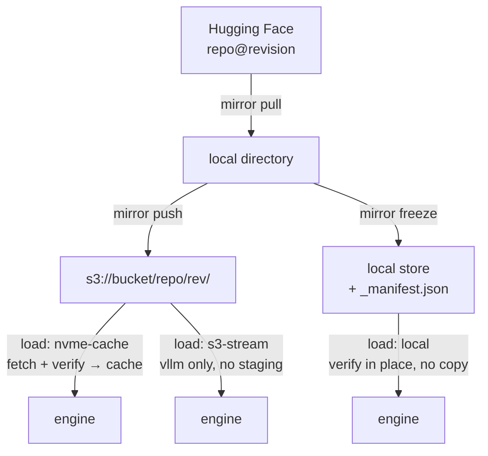

# Local weight loading (`load: local`)

## Problem

Both load modes assume S3. `Validate` requires `s3_prefix` to be a
revision-pinned `s3://<bucket>/<hf_repo>/<revision>/`, and `Serve` opens
the store from that prefix unconditionally. A node that holds its
weights on local NVMe and has no bucket cannot serve at all, even though
`mirror.OpenStore` already returns a `LocalStore` for a plain path or a
`file://` URI and every verification primitive is store-agnostic.

Two things are actually missing, and only two:

1. Validation forbids a non-S3 source.
2. `PrepareWeights` **copies** the store into `cacheRoot/<repo>/<rev>/`.
   When the store is already a local directory that is a full duplicate
   of the weights. On a [[019-gb10-serving-target]] node a 90 GB model
   becomes 180 GB on disk and pays the copy on every cold cache.

## The guarantee is not S3

[[002-weights-registry]] states the freeze guarantee as weights mirrored
once into versioned, checksummed prefixes and never re-fetched from
upstream. S3 is the *storage* that has been carrying it. The guarantee
itself is three properties:

- a **pinned 40-hex revision**, not a branch,
- a **per-file SHA-256 manifest** (`_manifest.json`) written last, so a
  partial mirror is detectable,
- **verification before launch**, every file, every start.

All three are portable to a local directory unchanged. Local loading is
therefore not a relaxation of the freeze model, and this spec keeps it
from becoming one.

## Decision

Add a third load mode.

```go
LoadLocal = "local"
```

```yaml
load: local
# no s3_prefix, and no path either
```

### The manifest names no directory

The weights sit at the layout `nvme-cache` already uses:

```
<weights-root>/<hf_repo>/<revision>/
```

with the **root supplied by the host** at serve time (`--cache-root`,
default `/cache` for the container images, something like `~/.models` on
a bare-metal host). The manifest carries the repo and revision, which
are properties of the model; the root is a property of the machine.

Putting an absolute path in the manifest was the obvious first design
and is wrong: `models/*.yaml` is checked into a public repo, so a path
like `/home/<user>/dev/llmops/weights/...` would commit one machine's
directory layout — and one person's username — into the shared source of
truth, and would need editing on every host. Splitting it this way keeps
one manifest describing the model everywhere, while the operator still
chooses exactly where weights live.

`--cache-root` expands a leading `~/`. systemd does not expand tilde in
`ExecStart`, so a unit written with `--cache-root ~/.models` would
otherwise create a directory literally named `~`.

### Validation

- `s3_prefix` must be **empty** when `load: local`. Two sources for one
  set of weights is the ambiguity this schema exists to prevent, so it
  is an error rather than a precedence rule.
- `s3_prefix` stays required and stays shape-checked for `nvme-cache`
  and `s3-stream`. Adding a third mode must not weaken the two that
  existed.

### PrepareWeights

```
load: local  →  verify <weights-root>/<hf_repo>/<revision> in place
                against _manifest.json, return it.
                Never copy, never fetch.
```

A hash mismatch **fails the launch**. It does not re-fetch, because
unlike `nvme-cache` there is no upstream to fall back to — a corrupt
local store is an operator problem, and silently repairing it would
defeat the freeze. This is the one behavioural difference between the
modes, and it is deliberate.

The `flock` on the directory still applies, in either deploy mode: a
serving process must not verify a directory that a `mirror` run is
writing, whether the two are pods on a node or a systemd unit and an
operator's shell.

### `mirror freeze`

`mirror pull` fetches a repo to a directory and `mirror push` writes
`_manifest.json` **into the store** as the last step. There is no way to
get that provenance artifact into a directory that will be served
directly. Add:

```sh
go run ./cmd/mirror freeze <repo>@<sha> --dir <weights-root>/<repo>/<sha>/
```

It runs the same tree/verify path as `push` and writes `_manifest.json`
in place. `mirror verify` already accepts any store prefix, so it works
on a local directory with no change.

## Diagram



## Considered and rejected: rename `s3_prefix` to `source`

The end state is one field holding a URI whose scheme selects the store,
which is what `OpenStore` already does internally. Two fields for one
concept is the weaker design.

Rejected **here** because the rename touches all six existing manifests,
`validateS3Prefix`, `deploycheck`, the mirror CLI and DEPLOY.md, and
this spec is meant to be small. It is worth doing as its own scoped
refactor. Recorded so the additive choice is visible as a deliberate
deferral rather than the intended shape.

## Acceptance criteria

- **AC1** `load: local` validates with no weight source named in the
  manifest, and resolves to `<weights-root>/<hf_repo>/<revision>`.
- **AC2** `load: local` with a non-empty `s3_prefix` is rejected, naming
  the conflict.
- **AC3** `s3_prefix` remains required and shape-checked for both S3
  modes — an existing manifest with it removed still fails.
- **AC4** `PrepareWeights` under `load: local` returns the resolved
  directory, performs no writes inside it beyond the lock file **at
  serve time**, and a test asserts no file is copied. The `mirror` tool
  is the only writer of a local store, and it runs before the endpoint
  starts, never during it.
- **AC4a** `--cache-root ~/.models` resolves against the user's home
  rather than creating a directory named `~`, since systemd does not
  expand tilde in `ExecStart`.
- **AC5** A corrupt file in a local store fails the launch with a hash
  mismatch and does **not** attempt a fetch.
- **AC6** `mirror freeze` writes a `_manifest.json` that `mirror verify`
  accepts, and that `PrepareWeights` then verifies clean.
- **AC7** `make e2e` covers pull → freeze → serve on a local directory
  with no S3 and no MinIO in the path.
- **AC8** DEPLOY.md documents the mode, including that it is the
  operator's job to place and freeze the directory.

## Out of scope

- Garbage-collecting local stores.
- Sharing one local store between nodes over a network filesystem.
- Making S3 optional for the fleet. `nvme-cache` stays the default and
  this mode does not change what the fleet does.
